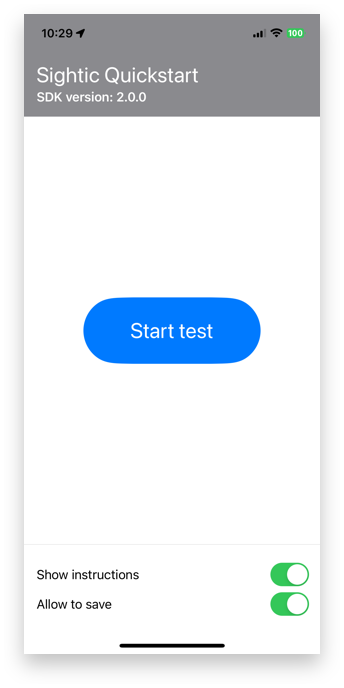
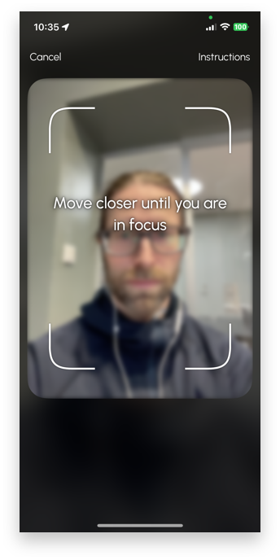
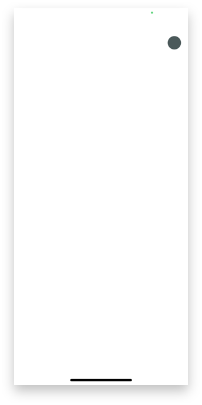
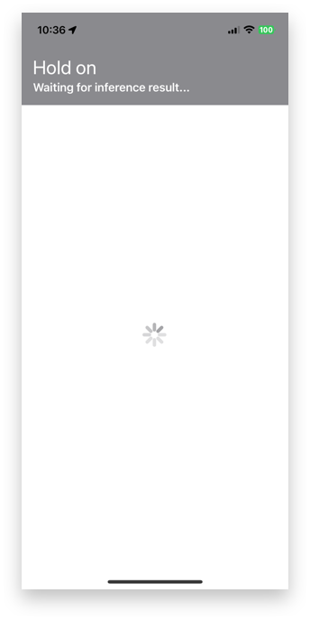
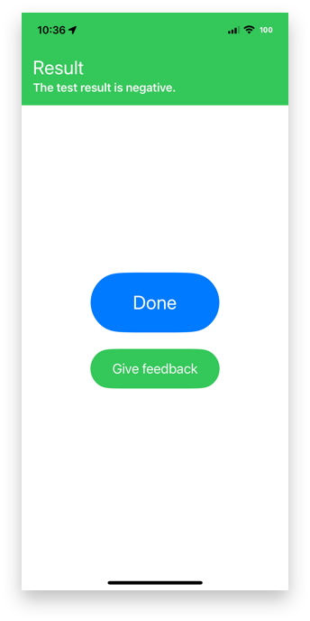
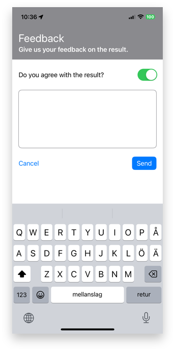
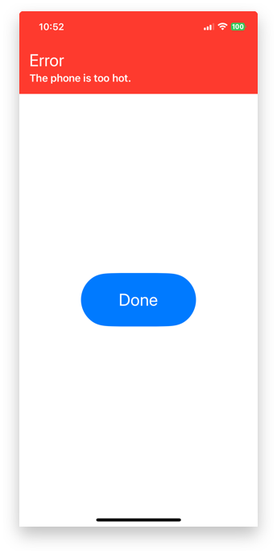

# Sightic SDK QuickStart app<!-- omit from toc -->

The Sightic SDK QuickStart app is intended to show developers how to integrate the [Sightic Analytics iOS SDK](https://github.com/SighticAnalytics/sightic-sdk-ios).

## Contents<!-- omit from toc -->

- [Overview](#overview)
- [SDK documentation](#sdk-documentation)
- [API key](#api-key)
- [App signing](#app-signing)
- [Run app](#run-app)
- [App flow](#app-flow)
  - [StartView](#startview)
  - [TestView](#testview)
  - [InferenceView](#inferenceview)
  - [ResultView](#resultview)
  - [FeedbackView](#feedbackview)
  - [ErrorView](#errorview)

## Overview

* The QuickStart app is written in Swift/SwiftUI.
* It adds the [Sightic Analytics iOS SDK](https://github.com/SighticAnalytics/sightic-sdk-ios) as a Swift Package Manager dependency.

## SDK documentation

* SDK documentation is [available here](https://sighticanalytics.github.io/sightic-sdk-ios/documentation/sighticanalytics/).
* The [Integrating with Your App](https://sighticanalytics.github.io/sightic-sdk-ios/documentation/sighticanalytics/integrating) page explains in more detail how to integrate the SDK.

## API key

* The SDK requires an API key.
* Add your API key in the `@main` entry point in `SighticQuickstart.swift`.

## App signing

1. Open `SighticQuickstart.xcodeproj` in Xcode.
2. Navigate to the Signing and Capabilities tab for the `SighticQuickstart` target.
3. Change _team_ to your team.
4. Change _Bundle identifier_ to something unique.
5. Check _Automatically manage signing_.

## Run app

1. Open `SighticQuickstart.xcodeproj` in Xcode.
2. Select a device as destination. Please note that the Sightic test does not run on an iOS Simulator.
3. Run `⌘R` the app.

## App flow

The following sections describe the [Sightic Analytics user interface flow](https://sighticanalytics.github.io/sightic-sdk-ios/documentation/sighticanalytics/phases/) as implemented by the QuickStart app. 

### StartView

`StartView` contains a button to go to the `TestView`. It also allows you to configure properties passed into `SighticView` in `TestView`:

* Whether to show the instructions.
* Whether to allow the server to save data from the test. The data sent to server contains facial features of the app user. It does not contain a video that can identify the user.



### TestView

`TestView` is a container for `SighticView`. `SighticView` is part of [Sightic Analytics iOS SDK](https://github.com/SighticAnalytics/sightic-sdk-ios) and flows through the following phases:

1. Alignment: A view that helps the user achieve the correct positioning of their phone and head.<br>
   
2. Test: A view that displays an animated dot that the user should follow with their eyes.<br>
  

When the test has finished `SighticView` calls the completion handler with a [`Result`]([https:://todo](https://developer.apple.com/documentation/swift/result)) value containing either `SighticRecording` or `SighticRecordingError`. These are passed to `InferenceView` and `ErrorView` respectively.

```swift
SighticView( ... ) { result in
    switch result {
    case .success(let recording):
        // Use recording.performInference() to send the recording for analysis
    case .failure(let error):
        // Use error to present that something went wrong
    }
}
```

### InferenceView

`InferenceView` takes a `SighticRecording` and sends it for analysis to the Sightic backend. Again, a `Result` value is returned, this time containing either `SighticInference` or `SighticError`. These are passed on to `ResultView` and `ErrorView` respectively.

```swift
let recording: SighticRecording

switch await recording.performInference( ... ) {
case .success(let inference):
    // Use inference to present test results
case .failure(let error):
    // Use error to present that something went wrong
}
```



### ResultView

`ResultView` displays the result contained in `SighticInference`. It optionally allows the user to open `FeedbackView` or return to `StartView`

The SighticInference value contains the inference result in the `hasImpairment: Bool` property.

```swift
let inference: SighticInference

Text(inference.hasImpairment
    ? "The test result is positive."
    : "The test result is negative."
)
```



### FeedbackView

The `SighticInference` value also contains a `sendFeedback` function for sending feedback on the inference result to Sightic Analytics. This view is presented if the user opted to send feedback in `ResultView`. 

```swift
let inference: SighticInference

do {
    try await inference.sendFeedback(
        isAgreeing ? .agree : .disagree,
        comment: comment
    )
    // Feedback was sent successfully
} catch {
    // Failed to send feedback
}
```

I



### ErrorView

This view is presented if an error occured during the test or when performing inference.



> Note: While charging the phone may get too hot to perform the test. This can often be the case while developing since you will usually have a cable connected for testing and debugging. In the field this is a very rare occurence.
