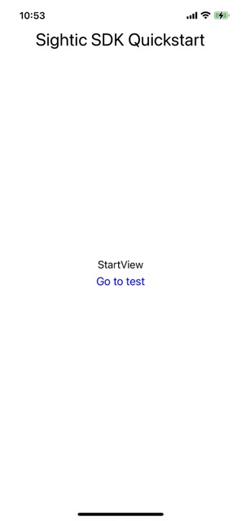
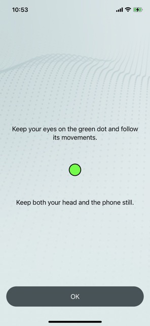
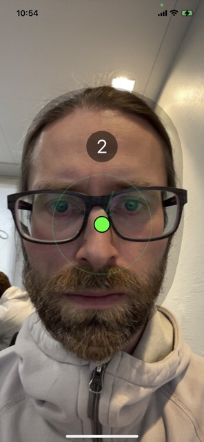
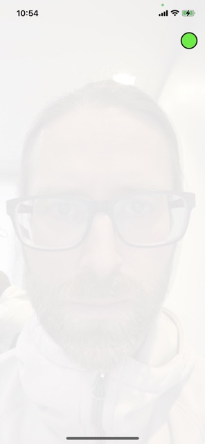
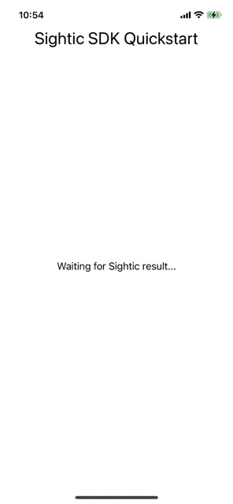
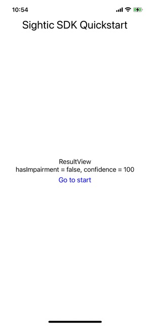

# QuickStart app for the Sightic Analytics iOS SDK

The purpose of this app is to show developers how to integrate the [Sightic Analytics iOS SDK](https://github.com/SighticAnalytics/sightic-sdk-ios) in their project.

## SDK Requirements

* Platforms
  * iOS 15
  * iPhone 12 or later (except iPhone SE) is recommended
* Programming languages
  * Swift 5
  * No Objective-C support
* Package managers
  * Swift Packages
  * No CocoaPods support
  * No Carthage support

## SDK API key

The SDK requires an API key in order to provide the app with a result. Please get in touch with [Sightic Analytics](https://www.sighticanalytics.com/contact) to retrieve a key.

## How to use the SDK

### App adds view SighticInferenceView

1. Add `SighticAnalytics` as a Swift package to your app using the URL https://github.com/SighticAnalytics/sightic-sdk-ios. You can also [add the SDK as a xcframework](https://github.com/SighticAnalytics/sightic-sdk-quickstart-app-ios#add-sdk-as-xcframework-instead-of-swift-package).
1. Add the SwiftUI view `SighticInferenceView` somewhere in your app. You must let the view occupy the **whole** screen. The view requires:
   * An API key
   * A bool stating whether to show instructions to the app user prior to starting the test itself.
   * A completion handler of type `(SighticInferenceRecordingResult) -> ()`.
1. Show the `SighticInferenceView` view to start the test. The face of the user will be recorded during a test sequence involving eye movements.

### App receives a SighticInferenceRecordingResult in completion handler from SighticInferenceView

1. The `SighticInferenceView` triggers the completion handler back to the app to indicate that the recording has finished.
1. The app receives a `SighticInferenceRecordingResult` object through the callback.
1. `SighticInferenceRecordingResult` is a result type that is either a success containing `SighticInferenceRecording` or a failure containing a `SighticError`.

### App makes a peformInference request on the SighticInferenceRecording

1. `SighticInferenceRecording` implements a function named `performInference`.
1. The app shall call the `performInference` method to send the recorded data to the `Sightic Analytics` server for analysis.
1. `performInference` is an async function and will return a `SighticInferenceResult` object when done.
1. `SighticInferenceResult` is a result type that contains either a `SighticInference` or a `SighticError`.
1. The `SighticInference` object contains a `bool` property named `hasImpairment` that can be used by the app to present the result.

## Translations using custom strings

A number of user-visible strings can be customized by the host application, by implementing the protocol `SighticStrings` and provide it to the `SighticInferenceView`. This could for example be used to add support for more languages. The host application is then expected to return a non-nil string for each property defined by the protocol. The protocol is documented with a brief comment of what the string is supposed to say.

If a `nil` value is returned, the SDK will fallback to a default value based on the current language setting. For this to work properly it is important that the returned value is `nil`, and not any other default value.

To add custom strings, do the following:

* Create a new type that implements `protocol SighticStrings` (a struct for example).
* Return a custom string for each property.
* Assign an instance to the static property `SighticAnalytics.Strings.customStrings` somewhere in your app's initialization phase.

For example:

```swift
struct MyStrings: SighticStrings {
    
    var alignHoldCloser: String? {
        let str = NSLocalizedString("sightic-align-hold-closer", comment: "")
        return str != "sightic-align-hold-closer" ? str : nil // nil if not found
    }
    
    // ... repeat for every property ...
}
```

### Providing strings to the SDK

```swift
@main
struct MyApp: App {
    init() {
        SighticAnalytics.Strings.customStrings = MyStrings()
    }
    
    var body: some Scene {
      WindowGroup {
        ContentView()
      }
    }
```

## How to check device and SDK backend support

### Is the SDK version supported by the Sightic Analytics backend?

```swift
switch await SighticVersion.sdkVersions(apiKey: "your-api-key-here") {
case let .success(sdkVersions):
    if sdkVersions.isCurrentVersionSupported {
        // Start using the SDK.
    }
    else {
        // Using the current version is not recommended.
        print("Current version (\(SighticVersion.sdkVersion)) is unsupported.")
        print("Supported versions are: \(sdkVersions.supportedVersions)")
    }
case let .failure(error):
    print("an error occurred: \(error)")
}
```

If the current version is outdated, this might print the following.

```text
Current version (0.0.46) is unsupported.
Supported versions are: ["0.0.47", "0.0.48", "1.0"]
```

### Is my device supported?

```swift
if SighticSupportedDevices.isCurrentDeviceSupported {  
    // Use SDK
}
```

## App overview

* There is one QuickStart app variant for UIKit based apps in the folder `SighticQuickstartUIKit`.
* There is one QuickStart app variant for SwiftUI based apps in the folder `SighticQuickstartSwiftUI`.
* The deployment target is set to iOS 15 for both the SwiftUI and the UIKit variants.
* Both variants add [Sightic Analytics iOS SDK](https://github.com/SighticAnalytics/sightic-sdk-ios) as a Swift Package.

## SDK API key in the QuickStart apps

You must provide an API key to the SDK in order to run the QuickStart apps successfully:
* `SighticQuickstartUIKit`: Add the API key to the `AppDelegate.swift`.
* `SighticQuickstartSwiftUI`: Add the API key to `SighticQuickstartSwiftUIApp.swift`.

## Configure signing

The steps below use names from the SwiftUI variant.

1. Open `SighticQuickstartSwiftUI/SighticQuickstartSwiftUI.xcodeproj` with Xcode.
1. Navigate to the Signing and Capabilites pane for the `SighticQuickstartSwiftUI` target.
1. Change _team_ to your team.
1. Change _Bundle identifier_ to something unique.
1. Check _Automatically manage signing_.

## Run app

1. Select the _SighticQuickstartSwiftUI_ or _SighticQuickstartUIKit_ scheme in Xcode depending on what variant you are running.
1. Select a Simulator or Device as destination. Please observe that the test can only be run on a device. A replacement view will be instead of the test by the SDK when running on a simulator so that the flow of the app can be tested.
1. Run `⌘R` the app.

## App flow

The SwiftUI and UIKit Quickstart variants have similar flow. The screenshots below are from the UIKit variant.

### StartViewController

The `StartViewController` contains a button to go to the `TestViewController`.



### TestViewController

The `TestViewController` is a container for the `SighticInferenceView`. The `SighticInferenceView` is part of [Sightic Analytics iOS SDK](https://github.com/SighticAnalytics/sightic-sdk-ios) and performs the following steps:
1. Shows an instruction view to the user.<br>
   
1. The next step is to help the user position the phone and their head correctly.<br>
   
1. A dot is shown to the user while the test itself is running. The user is supposed to follow the dot with their eyes.<br>
  

The `SighticInferenceView` triggers a callback to the app to indicate that the recording has finished. The app receives a `SighticInferenceRecordingResult` object through the callback. `SighticInferenceRecordingResult` is a result type that is either a success containing `SighticInferenceRecording` or a failure containing a `SighticError`. `SighticInferenceRecording` implements a function named `performInference`. The app shall call the `performInference` method to send the recorded data to the Sightic Analytics server for analysis.

### WaitingViewController

The analysis by the Sightic server may take a couple of seconds. The QuickStart app shows `WaitingViewController` to inform the app user about the status.



### ResultViewController

The `performInference` is an async function and will return a `SighticInferenceResult` object when done. `SighticInferenceResult` is a result type that contains either a `SighticInference` or a `SighticError`. The `SighticInference` object contains a `bool` property named `hasImpairment` that can be used by the app to present the result. The QuickStart app shows the raw value of `hasImpairment`.



## Add SDK as xcframework instead of Swift Package

You can add the [Sightic Analytics iOS SDK](https://github.com/SighticAnalytics/sightic-sdk-ios) as a xcframework to your app instead of as a Swift Package:

1. Remove `SighticAnalytics` Swift Package on the _Package Dependencies_ pane of the the _SighticQuickstart_ project.
   
1. Goto https://github.com/SighticAnalytics/sightic-sdk-ios/releases
1. Scroll to the release you would like to use.
1. Download the file `SighticAnalytics.xcframework.zip`.<br>
   
1. Unpack the zip file<br>
   
1. Drag `SighticAnalytics.xcframework` into your app projext in Xcode.<br>
   
1. Add `SighticAnalytics` as a framework in the General pane of the `SighticQuickstartUIKit` target.<br>
   
