# QuickStart app for the Sightic Analytics iOS SDK

The purpose of this app is to show developers how to integrate the [Sightic Analytics iOS SDK](https://github.com/SighticAnalytics/sightic-sdk-ios) in their project.

## SDK Overview

The SDK provides a view named `SighticInferenceView` that you must add to your app. The SDK goes through the following phases:
1. **Instruction screen**<br>The instruction screen shows the app user how to perform the test. The instruction screen can be disabled through a parameter to the `SighticInferenceView` init method.
2. **Alignment screen**<br>The purpose of the alignment view is to make sure the face of the app user is positioned correctly in front of the screen. `SighticInferenceView` presents an alignment view with a face mesh to provide the app user with visual clues on how to position her device and face. The app can subscribe to alignment status updates from the SDK by providing a closure. The app should use the alignment status updates to show hints and a countdown as overlays on the `SighticInferenceView`. The QuickStart app shows an example of how to do this.
3. **Test screen**<br>A green moving dot is presented to the app user during the test phase. The app user must follow the dot with her eyes. The test sequence has a duration of about 25 seconds.
4. **Recording object**<br>The `SighticInferenceView` provides the app with the recorded data. The app sends the recorded data to the Sightic Analytics server for analysis. The data sent to server contains features extracted from the face of the app user. The data does not contain a video stream that can be used to identify the user.
6. **Result object**<br>The app will receive a boolean value back from the Sightic Analytics server that contains the result of the analysis.
7. **Feedback**<br>The app can optionally collect feedback from the user whether she deems the result correct and send this information to Sightic Analytics. The information is used by Sightic Analytics to improve our model.

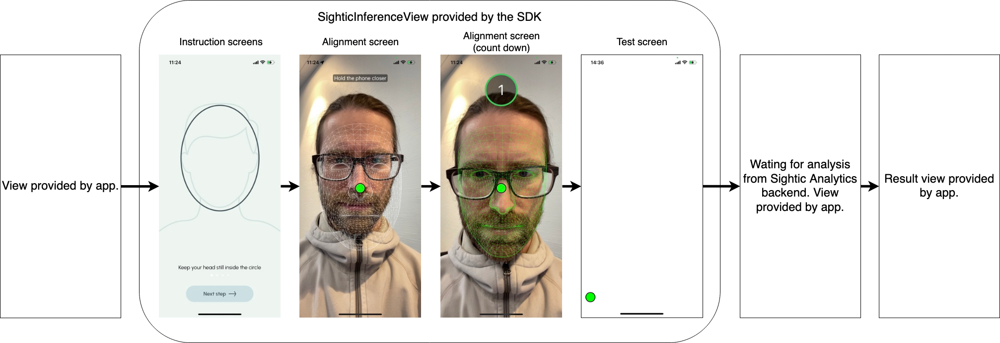

## SDK Requirements

* Platforms
  * iOS 15 or later
  * iPhone 12 or later (except iPhone SE)
* Programming languages
  * Swift 5
  * No Objective-C support
* Package managers
  * [Swift Package Manager](https://www.swift.org/package-manager/)
  * No CocoaPods support
  * No Carthage support

## SDK API key

The SDK requires an API key in order to provide the app with a result. Please get in touch with [Sightic Analytics](https://www.sighticanalytics.com/contact) to retrieve a key.

## How to use the SDK in your app

### Add Swift package

Add `SighticAnalytics` as a Swift package to your app using the URL https://github.com/SighticAnalytics/sightic-sdk-ios.

You can also [add the SDK as a xcframework](https://github.com/SighticAnalytics/sightic-sdk-quickstart-app-ios#add-sdk-as-xcframework-instead-of-swift-package).

### Camera usage description

The SDK needs access to the device's camera and thus you must add a [camera usage description](https://developer.apple.com/documentation/bundleresources/information_property_list/nscamerausagedescription) to your app in the [Info.plist](https://developer.apple.com/documentation/bundleresources/information_property_list/managing_your_app_s_information_property_list).

Another option is to set the camera usage description in your build settings if you have enabled automatic generation of an Info.plist file ([GENERATE_INFOPLIST_FILE](https://developer.apple.com/documentation/xcode/build-settings-reference)).

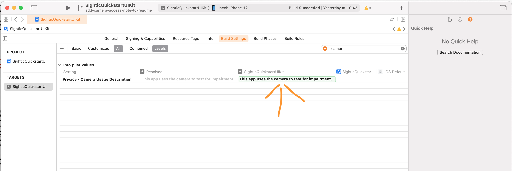

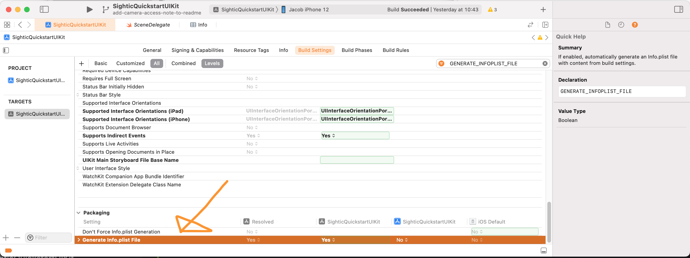

### Add the SighticInferenceView

1. Add the SwiftUI view `SighticInferenceView` somewhere in your app. You must let the view occupy the **whole** screen.
1. The `SighticInferenceView` requires:
   * An API key
   * A bool stating whether to show instructions to the app user.
   * A completion handler of type `(SighticInferenceRecordingResult) -> ()`.
1. The app should provide a closure to receive `SighticStatus` updates. The updates should be used by the app to add alignment hints as overlays on the alignment screen below.

### SighticInferenceView shows instruction screens

The instruction screens provided by the SDK show the app user how to perform the test. You can disable those views using a parameter to the init method of `SighticInferenceView` and create instructions with your own design instead. Please include the following information when informing the app user about the test:

* Tell the app user to hold their phone straight in front of their face
* Tell the app user to follow the green dot with their eyes during the test
* Tell the app user to hold the phone still during the test
* Tell the app user to avoid talking during the test
* Tell the app user to keep their eyes open during the test

The images below show what the instruction views provided by the SDK look like.


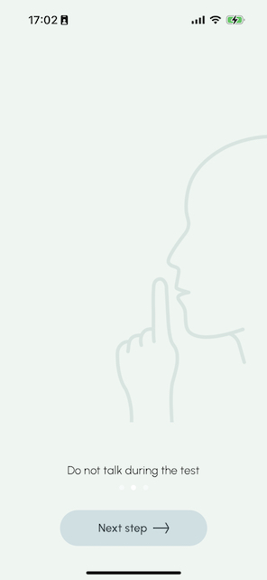

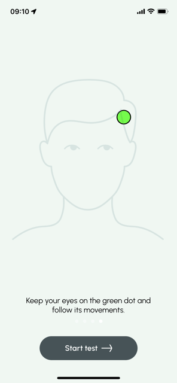

### SighticInferenceView shows alignment screen

The alignment screen helps the app user position her face in front of the screen. The face mesh will become green when the SDK deems the app user face to be in the correct position.

The app shall add alignment hints and a countdown as overlays on the alignment screen using the `SighticStatus` callback. The QuickStart app code shows an example of how this can be done:
* See `AlignmentHintViewController` for the UIKit variant.
* See `AlignmentHintView` for the SwiftUI variant.

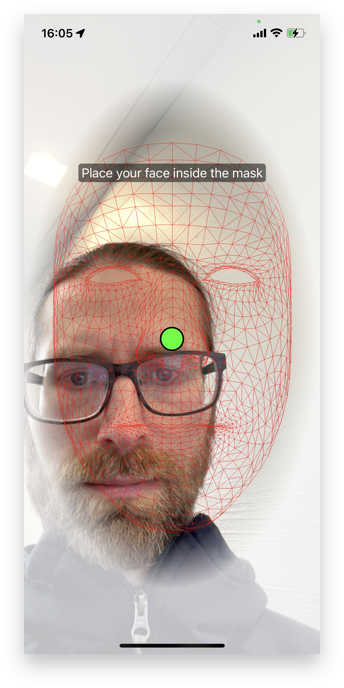
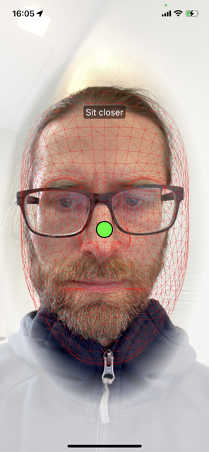
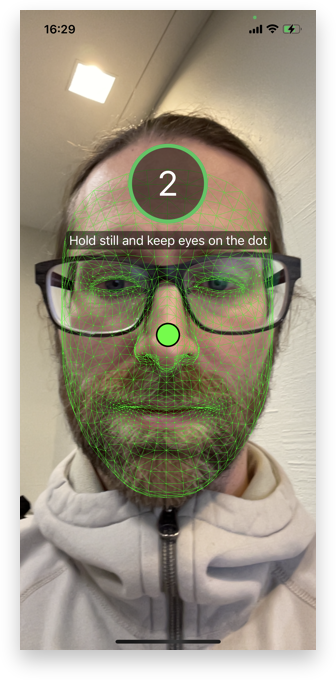

### SighticInferenceView shows test screen

A green moving dot is presented during the test phase. The app user is supposed to follow the dot with her eyes and keep the phone still. The SDK records the face of the user during the test phase.

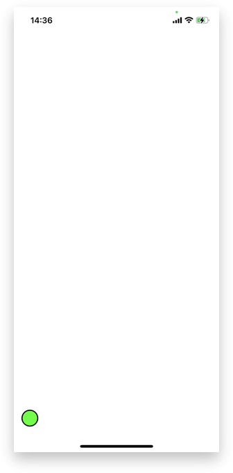

### App receives a SighticInferenceRecordingResult in completion handler from SighticInferenceView

1. The `SighticInferenceView` triggers the completion handler back to the app to indicate that the recording has finished.
1. The app receives a `SighticInferenceRecordingResult` object through the callback.
1. `SighticInferenceRecordingResult` is a result type that is either a success containing `SighticInferenceRecording` or a failure containing a `SighticError`.

### App makes a peformInference request on the SighticInferenceRecording

1. `SighticInferenceRecording` implements a function named `performInference(allowToSave: Bool)`.
1. The app shall call the `performInference` method to send the recorded data to the `Sightic Analytics` server for analysis.
1. By setting the parameter `allowToSave` to `true`, you can give the server permission to save the inference input data. This can then be used to improve the application. Most importantly, the inference input data is anonymized and does not contain any personal information, nor can it be used to identify a real person, or the device that was used to collect the data.
1. `performInference` is an async function and will return a `SighticInferenceResult` object when done.
1. `SighticInferenceResult` is a result type that contains either a `SighticInference` or a `SighticError`.
1. The `SighticInference` object contains a `bool` property named `hasImpairment` that can be used by the app to present the result.

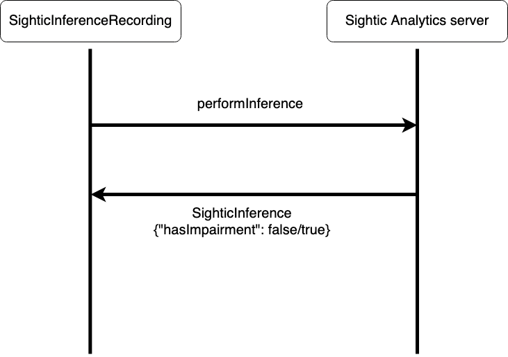

### App optionally sends feedback to Sightic Analytics regarding result

1. `SighticInference` implements a function named `sendFeedback`.
1. The app can optionally call `sendFeedback` to provide `Sightic Analytics` with feedback regarding the inference result.

## How to use SighticStatus optionally provided by the SDK

The SDK can optionally provide `SighticStatus` information to make it possible for the app to create its own alignment screen. `SighticStatus` is an enum that contains `SighticAlignmentStatus`. It also shows when countdown is ongoing and when the test itself has started. The app must remove its alignment overlay when the test starts.

## Translations using custom strings

A number of user-visible strings can be customized by the host application, by implementing the protocol `SighticStrings` and provide it to the `SighticInferenceView`. This could for example be used to add support for more languages. The host application is then expected to return a non-nil string for each property defined by the protocol. The protocol is documented with a brief comment of what the string is supposed to say.

If a `nil` value is returned, the SDK will fallback to a default value based on the current language setting. For this to work properly it is important that the returned value is `nil`, and not any other default value.

To add custom strings, do the following:

* Create a new type that implements `protocol SighticStrings` (a struct for example).
* Return a custom string for each property.
* Assign an instance to the static property `SighticAnalytics.Strings.customStrings` somewhere in your app's initialization phase.

For example:

```swift
struct MyStrings: SighticStrings {
    
    var alignHoldCloser: String? {
        let str = NSLocalizedString("sightic-align-hold-closer", comment: "")
        return str != "sightic-align-hold-closer" ? str : nil // nil if not found
    }
    
    // ... repeat for every property ...
}
```

### Providing strings to the SDK

```swift
@main
struct MyApp: App {
    init() {
        SighticAnalytics.Strings.customStrings = MyStrings()
    }
    
    var body: some Scene {
      WindowGroup {
        ContentView()
      }
    }
```

## How to check if my device is supported

This code sample checks if the current device is supported, through a backend call.

```swift
do {
    guard try await SighticSupportedDevices().isCurrentSupported else {
      // Handle the case where the current phone model is not supported
    }

    // Continue with test
}
catch {
    print("Error while checking for supprted devices: \(error)")
}
```

## App overview

* There is one QuickStart app variant for UIKit based apps in the folder `SighticQuickstartUIKit`.
* There is one QuickStart app variant for SwiftUI based apps in the folder `SighticQuickstartSwiftUI`.
* The deployment target is set to iOS 15 for both the SwiftUI and the UIKit variants.
* Both variants add [Sightic Analytics iOS SDK](https://github.com/SighticAnalytics/sightic-sdk-ios) as a Swift Package.

## SDK API key in the QuickStart apps

You must provide an API key to the SDK in order to run the QuickStart apps successfully:
* `SighticQuickstartUIKit`: Add the API key to the `AppDelegate.swift`.
* `SighticQuickstartSwiftUI`: Add the API key to `SighticQuickstartSwiftUIApp.swift`.

## Configure signing

The steps below use names from the SwiftUI variant.

1. Open `SighticQuickstartSwiftUI/SighticQuickstartSwiftUI.xcodeproj` with Xcode.
1. Navigate to the Signing and Capabilites pane for the `SighticQuickstartSwiftUI` target.
1. Change _team_ to your team.
1. Change _Bundle identifier_ to something unique.
1. Check _Automatically manage signing_.

## Run app

1. Select the _SighticQuickstartSwiftUI_ or _SighticQuickstartUIKit_ scheme in Xcode depending on what variant you are running.
1. Select a Simulator or Device as destination. Please observe that the test can only be run on a device. A replacement view will be instead of the test by the SDK when running on a simulator so that the flow of the app can be tested.
1. Run `⌘R` the app.

## App flow

The SwiftUI and UIKit Quickstart variants have similar flow. The screenshots below are from the SwiftUI variant.

### StartViewController

The `StartViewController` contains a button to go to the `TestViewController`. It also allows you to configure the `SighticInferenceView`:

* Whether to show the instruction screens
* Whether to overlay the default alignment screen with another view that shows `SighticStatus` provided by the SDK in an optional closure to the app. 

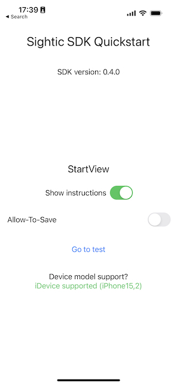

### TestViewController

The `TestViewController` is a container for the `SighticInferenceView`. The `SighticInferenceView` is part of [Sightic Analytics iOS SDK](https://github.com/SighticAnalytics/sightic-sdk-ios) and performs the following phases:

1. Shows an instruction view to the user.<br>
   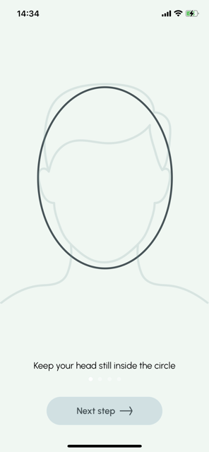
1. The next step is an alignment screen to help the user position the phone and their head correctly. The QuickStart app overlays the default alignment screen with alignment hints and a countdown using information in the `SighticStatus` closure.<br>
   
1. A dot is shown to the user while the test itself is running. The user is supposed to follow the dot with their eyes.<br>
  

The `SighticInferenceView` triggers a callback to the app to indicate that the recording has finished. The app receives a `SighticInferenceRecordingResult` object through the callback. `SighticInferenceRecordingResult` is a result type that is either a success containing `SighticInferenceRecording` or a failure containing a `SighticError`. `SighticInferenceRecording` implements a function named `performInference`. The app shall call the `performInference` method to send the recorded data to the Sightic Analytics server for analysis. The data sent to server contains features extracted from the face of the app user. The data does not contain a video stream that can be used to identify the user.

### WaitingViewController

The analysis by the Sightic server may take a couple of seconds. The QuickStart app shows `WaitingViewController` to inform the app user about the status.

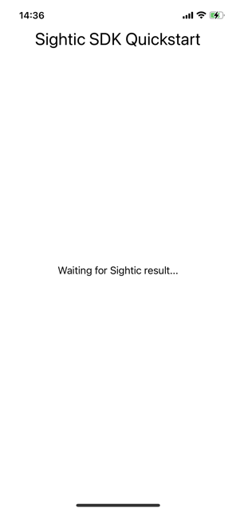

### ResultViewController

The `performInference` is an async function and will return a `SighticInferenceResult` object when done. `SighticInferenceResult` is a result type that contains either a `SighticInference` or a `SighticError`. The `SighticInference` object contains a `bool` property named `hasImpairment` that can be used by the app to present the result. The QuickStart app shows the raw value of `hasImpairment`.

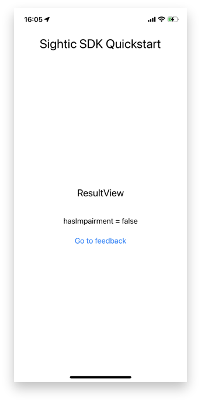

### ErrorViewController

An error view is shown if something goes wrong when using the test. In the screenshot below the app user moved the phone during the test so that her face was no longer in the correct position. The test was aborted and an error was shown.

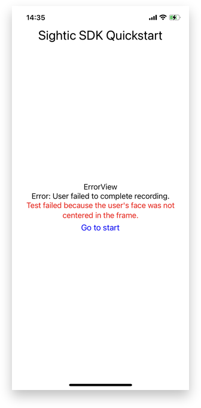

### FeedbackViewController

A feedback view is shown to give the app user the possibility to provide feedback on the inference result. The user can provide a boolean value whether she agrees with the result and also provide free text feedback.

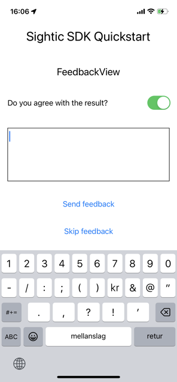

## Add SDK as xcframework instead of Swift Package

You can add the [Sightic Analytics iOS SDK](https://github.com/SighticAnalytics/sightic-sdk-ios) as a xcframework to your app instead of as a Swift Package:

1. Remove `SighticAnalytics` Swift Package on the _Package Dependencies_ pane of the the _SighticQuickstart_ project.
   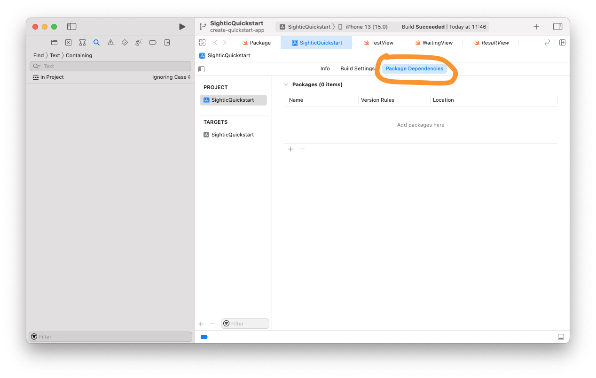
1. Goto https://github.com/SighticAnalytics/sightic-sdk-ios/releases
1. Scroll to the release you would like to use.
1. Download the file `SighticAnalytics.xcframework.zip`.<br>
   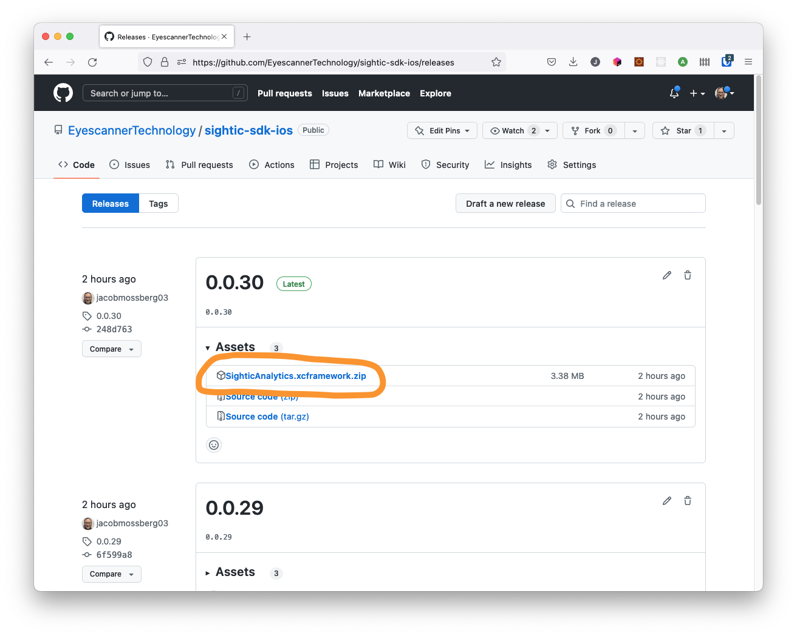
1. Unpack the zip file<br>
   
1. Drag `SighticAnalytics.xcframework` into your app projext in Xcode.<br>
   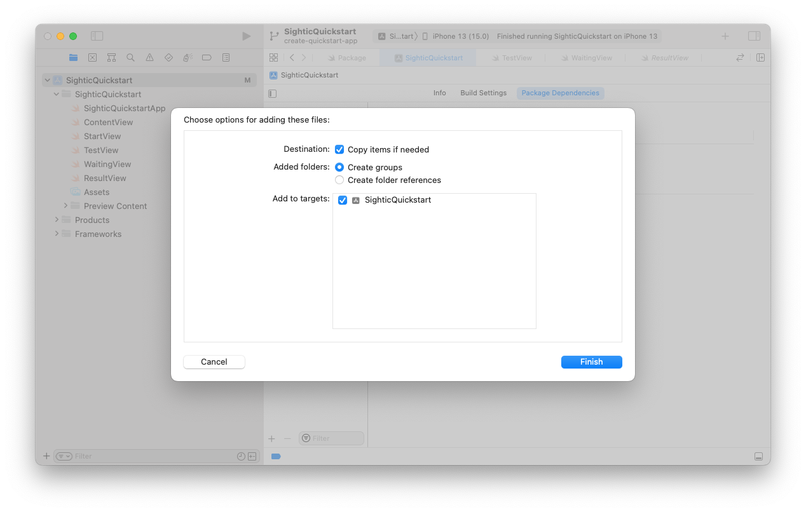
1. Add `SighticAnalytics` as a framework in the General pane of the `SighticQuickstartUIKit` target.<br>
   
