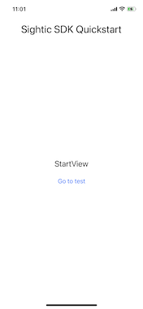
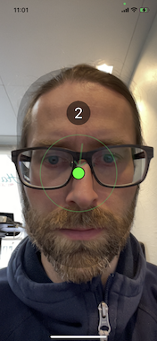
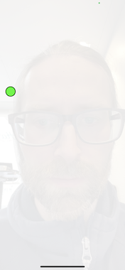
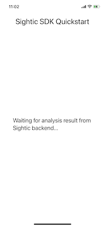
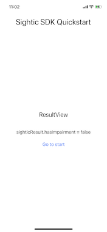

# QuickStart app for the Sightics Analytics iOS SDK

The purpose of this app is to show developers how to integrate the [Sightics Analytics iOS SDK](https://github.com/EyescannerTechnology/sightic-sdk-ios) in their project.

## App overview

* The app uses SwiftUI
* The deployment target is set to iOS 15
* The app adds [Sightics Analytics iOS SDK](https://github.com/EyescannerTechnology/sightic-sdk-ios) as a Swift Package.

### Start view

The start view contains a button to go to the `TestView`.

### Test view

The test view is a container for the `SighticView`. The `SighticView` is part of [Sightics Analytics iOS SDK](https://github.com/EyescannerTechnology/sightic-sdk-ios) and performs the following steps:
1. Shows an instruction view to the user. 
   
1. The next step is to help the user position the phone and their head correctly. 
   
1. A dot is shown to the user while the test itself is running. The user is supposed to follow the dot with their eyes. 
  

The `SighticView` triggers a callback to the app to indicate that the test has finished. The app receives a `SighticRecording` object through the callback. `SighticRecording` implements a function named `performInference`.

### Waiting for analysis view

The app shall call the `performInference` method to send the recorded data to the `Sightic` server for analysis. This may take a couple of seconds. The QuickStart app impelements a `WaitingView` to inform the app user about the status.

### Result view

The `performInference` is an async function and will return a `SighticResult` object when done. The `SighticResult` object contains a bool property named `hasImpairment` that can be used by the app to present the result. The QuickStart app shows the raw value of `hasImpairment`.

## Configure signing

1. Open `SighticQuickstart/SighticQuickstart.xcodeproj` with Xcode.
1. Navigate to the Signing and Capabilites pane for the `SighticQuickstart` target.
1. Change _team_ to your team.
1. Change _Bundle identifier_ to something unique.
1. Check _Automatically manage signing_.

## Run

1. Select the _SighticQuickstart_ scheme in Xcode
1. Select a Simulator or Device as destination. Please observe that the test can only be run on a device. A replacement view will be instead of the test by the SDK when running on a simulator so that the flow of the app can be tested.
1. Run `⌘R` the app.